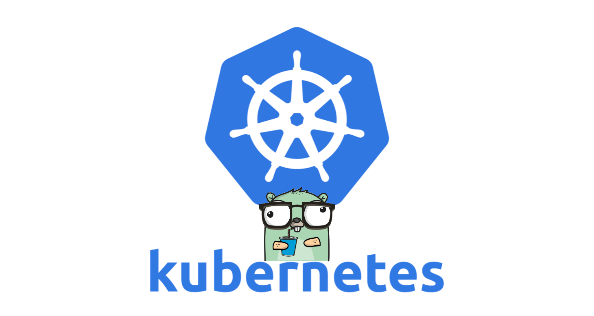

<h1 align="center"> kubectl-pdborked </h1> <br>
<p align="center">
  
</p>

<p align="center">
  A kubectl plugin to identify problematic pod disruption budgets
</p>

## Introduction


[](https://goreportcard.com/report/github.com/paddymorgan84/kubectl-pdborked)

`kubectl-pdborked` is a kubectl plugin extension to identify PDBs with no allowed disruptions.

## Pre-requisites

- [Go version 1.19 or higher](https://golang.org/dl/)

## Installation

Installing the plugin is very straightforward:

```bash
> git clone https://github.com/paddymorgan84/kubectl-pdborked.git
> cd kubectl-pdborked
> go install
```

This will install at your specified `$GOPATH`. Provided your `$GOPATH` is included as part of your `$PATH` environment variable, kubectl will automatically discover the plugin.

```bash
> kubectl plugin list
The following compatible plugins are available:

/Users/Patrick.Morgan/go/bin/kubectl-pdborked
```
